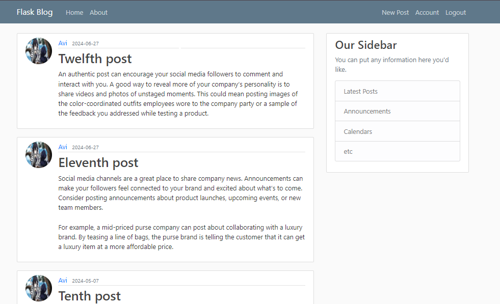

# Flask Blog

A blogging website built using the Python web framework Flask. Users can create accounts, log in, log out, post blogs, edit their profile, and read blogs posted by other users.

## Features
- **User Authentication**: Users can sign up, log in, and log out securely.
- **Profile Management**: Users can update their profile information such as username, email, and profile picture.
- **Create & Read Blogs**: Users can create their own blogs, edit or delete them, and read blogs written by other users.
- **Responsive Design**: The website is designed to be responsive and mobile-friendly.
- **Flask Extensions Used**: 
  - Flask-WTF for forms
  - Flask-Login for user authentication
  - Flask-SQLAlchemy for database interaction
  - Flask-Bcrypt for password hashing
  - Flask-Migrate for handling database migrations

## Installation

### Prerequisites
- Python 3.x installed on your system.
- A virtual environment (recommended) for managing dependencies.

### Steps
1. Clone the repository:
   ```bash
   git clone https://github.com/your-username/flask-blog.git
   cd flask-blog
   ```

2. Create a virtual environment:
   ```bash
   python3 -m venv venv
   ```

3. Activate the virtual environment:
   - On Windows:
     ```bash
     venv\Scripts\activate
     ```
   - On Mac/Linux:
     ```bash
     source venv/bin/activate
     ```

4. Install the required dependencies:
   ```bash
   pip install -r requirements.txt
   ```

5. Set environment variables (for development):
   ```bash
   export FLASK_APP=run.py
   export FLASK_ENV=development
   ```

6. Run the application:
   ```bash
   flask run
   ```

7. Navigate to `http://127.0.0.1:5000/` in your web browser.

## Database Setup
1. Initialize the database:
   ```bash
   flask db init
   flask db migrate -m "Initial migration"
   flask db upgrade
   ```

2. The database is now set up and ready to use.

## Project Structure
```
flask-project/
│
├── app/
│   ├── static/          # CSS, JS, Images
│   ├── templates/       # HTML templates
│   ├── __init__.py      # Flask app initialization
│   ├── models.py        # Database models
│   ├── routes.py        # Application routes
│   ├── forms.py         # Forms using Flask-WTF
│
├── run.py               # Entry point of the applicatio
├── README.md            # Project README
```

## Screenshots
### Home Page



## Contributing
Feel free to contribute by opening a pull request or reporting issues.

## License
This project is licensed under the MIT License - see the [LICENSE](LICENSE) file for details.
